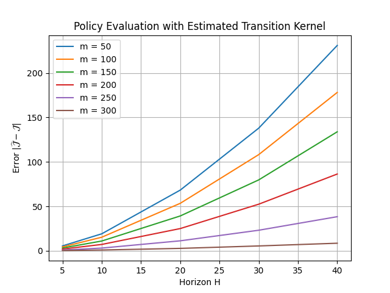

Designed a novel, scalable, mathematical algorithm for policy evaluation in offline reinforcement learning and empirically shown a finite error bound on the Q-value function. This work is published in ProQuest https://www.proquest.com/docview/3224180520?sourcetype=Dissertations%20&%20Theses

**Empirical Result:** 

